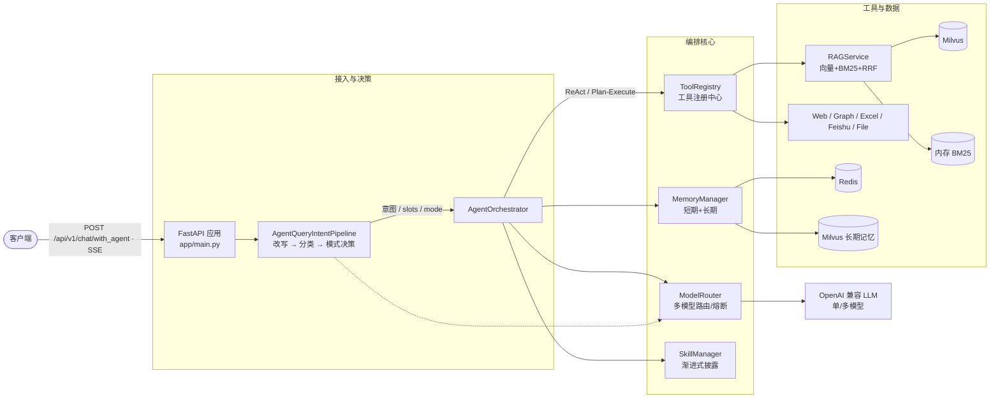

# Enterprise AI Agent · 企业级 AI Agent 服务

> 一个面向生产环境的企业级 AI Agent 基础框架：基于 **FastAPI + LangChain/LangGraph 风格编排 + RAG + 多模型路由**，内置**意图识别 Pipeline（改写 → 分类 → 编排模式决策）**、**ReAct / Plan-Execute 双模式 Agent 编排**、**短/长期记忆**、**混合检索 RAG**、**工具预算熔断**与**渐进式披露的高级技能（Skills）**系统。

[](https://www.python.org/)
[](https://fastapi.tiangolo.com/)
[](LICENSE)

---

## 目录

- [项目简介](#项目简介)
- [核心特性](#核心特性)
- [系统架构](#系统架构)
- [技术栈](#技术栈)
- [目录结构](#目录结构)
- [快速开始](#快速开始)
- [配置说明](#配置说明)
- [API 接口](#api-接口)
- [核心模块详解](#核心模块详解)
- [可观测性](#可观测性)
- [部署](#部署)
- [开发指南](#开发指南)
- [路线图 / 已知问题](#路线图--已知问题)
- [许可证](#许可证)
- [贡献](#贡献)

---

## 项目简介

本项目是一套**可运行、可扩展**的企业级 AI Agent 服务骨架，目标是把「大模型对话」升级为「能调用工具、能检索私有知识、能记住上下文、能按意图选择执行策略」的智能体。

它不是一个最小 demo，而是一套带有完整生产化考量的架构：

- **统一模型路由**：内置多模型路由器，支持单模型 / 多模型分层（FAST / STANDARD / DEEP）路由，带**熔断、健康探测与候选降级**。
- **意图前置决策**：每次请求先经过 3 阶段意图 Pipeline（查询改写 → 意图聚合分类 → 编排模式决策），再由 Agent 编排器据此选择 `react` 或 `plan_execute`，并把「该用哪些工具、先调哪个工具、命中哪个知识库集合」一并下发，避免 Agent 在空想中盲目试错。
- **双模式 Agent 编排**：`ReAct`（Thought→Action→Observation 快速闭环）与 `Plan-and-Execute`（宏观拆解 + 重规划），并支持 Plan 失败自动降级 ReAct。
- **混合检索 RAG**：LlamaIndex 驱动的「向量（Milvus） + 关键词（BM25） + RRF 融合」混合检索。
- **联合记忆**：短期记忆（Redis 滑动窗口）+ 长期记忆（Milvus 向量召回），短期同步落库、长期异步沉淀，不阻塞主链路。
- **工具预算熔断**：单次请求内对工具调用做「单工具上限 / 累计无效 / 相关性抽查 / 全局总闸」四重约束，防止 Agent 死循环调用工具。
- **高级技能（Skills）**：基于 `SKILL.md` 的渐进式披露技能系统，让 Agent 按需加载领域专家工作流，并用 `allowed-tools` 精确号令可用工具。

---

## 核心特性

| 能力 | 说明 |
|------|------|
| 多模型路由与韧性 | 单模型兼容 / 多模型分层路由；异步熔断、健康预选、按 Tier 超时与候选顺序自动降级 |
| 意图识别 Pipeline | 查询改写（多子问题拆分）、意图聚合分类、向量意图树召回、Plan/ReAct 模式决策 |
| Agent 编排 | ReAct 与 Plan-and-Execute 双引擎，Plan 失败自动降级，空结果触发重规划 |
| 混合检索 RAG | Milvus 向量索引 + 内存 BM25 + RRF 融合重排；支持按「知识库集合」定向召回 |
| 联合记忆 | 短期（Redis 窗口/摘要）+ 长期（Milvus 向量）；并行装载、异步沉淀 |
| 工具系统 | 内置联网搜索（豆包 + Tavily 兜底）、RAG 检索、知识图谱、Excel、待办、飞书、文件读写等 |
| 预算熔断 | 单工具上限 / 累计无效 / 相关性抽查 / 全局总闸，约束 Agent 工具调用 |
| 高级技能 | `SKILL.md` 渐进式披露，命中技能后用 `allowed-tools` 精确号令工具集 |
| 可观测性 | 原生接入 Langfuse（Trace / Span / Generation），未配置则自动降级为 no-op |
| 工程化 | Dockerfile 镜像构建 + docker-compose 一键拉起中间件，Pydantic v2 配置，loguru 日志 |

---

## 系统架构



**一次 `/chat/with_agent` 请求的端到端流程：**

1. 拉取短期对话历史，与意图 Pipeline **并行**发起长期向量记忆召回（高延迟，重叠执行）。
2. 同步运行意图 Pipeline（以 `asyncio.to_thread` 包装，保持 `query_intent` 同步代码零侵入）：
   - **查询改写**：多子问题拆分、术语映射；
   - **意图聚合分类**：LLM 分类 + 向量意图树召回融合；
   - **模式决策**：规则化判断走 `react` 还是 `plan_execute`，并产出 `allowed_tools` / `first_tool_hint` / 知识库集合定向约束。
3. 系统意图（sys）命中时短路，直接走标准聊天核心，跳过昂贵 Agent 循环。
4. 否则交给 `AgentOrchestrator`：按决策模式驱动 ReAct / Plan-Execute，注入记忆、工具 Schema、技能提示词与工具预算。
5. 最终答案以 **SSE 流式**逐段吐出（`data: {"content": ...}` → `data: {"done": true, ...}`）。

---

## 技术栈

| 类别 | 技术 |
|------|------|
| Web 框架 | FastAPI、Uvicorn |
| Agent / LLM | LangChain、LangGraph、OpenAI 兼容 API（支持 DeepSeek / Qwen / GLM / Kimi 等） |
| 模型路由 | 自研 `ModelRouter`：异步熔断 + 分层 Tier + 候选降级 |
| 向量库 | Milvus（`pymilvus`） |
| 缓存 | Redis（`redis.asyncio`） |
| 关系库 | PostgreSQL + SQLAlchemy（异步 `asyncpg`） |
| RAG | LlamaIndex、`rank_bm25`（BM25）、RRF 融合 |
| Embedding | DashScope `text-embedding-v3`（dim=1024，固定单模型，不进路由） |
| 配置与校验 | Pydantic v2、pydantic-settings |
| 文档处理 | `unstructured`、`pypdf`、LlamaIndex 解析器 |
| 知识图谱 | LightRAG（`infrastructure/knowledgebase/light_rag.py`） |
| 日志与韧性 | loguru、tenacity、httpx |
| 可观测性 | Langfuse |

---

## 目录结构

```
Enterprise-aiagent/
├── app/
│   ├── main.py                      # FastAPI 入口 + lifespan 并行初始化
│   ├── config.py                    # Pydantic-settings 配置（含 LLM 分层解析）
│   ├── api/
│   │   ├── routes/                  # chat / document / kownledgebase / health 路由
│   │   └── depends/                 # FastAPI 依赖注入中心（含 Pipeline 装配）
│   ├── core/
│   │   ├── agent/                   # 编排器 + planner + react + reflection 占位
│   │   ├── rag/                     # RAGService / HybridRetriever / BM25 / parse
│   │   ├── memory/                  # 短期(Redis) / 长期(Milvus) / 管理器
│   │   ├── tools/                   # 工具注册中心 + 内置工具（builtin/）
│   │   ├── skill/                   # 技能管理器（渐进式披露）
│   │   ├── chat_recognizer/         # 意图识别（标准对话用）
│   │   └── backends/               # 虚拟/物理文件系统后端
│   ├── infrastructure/
│   │   ├── cache/   redis_cache.py
│   │   ├── database/                # SQLAlchemy 模型 + 会话
│   │   ├── embeddings/              # DashScope embedding 适配
│   │   ├── knowledgebase/           # LightRAG 封装
│   │   ├── trace/                   # Langfuse 接入
│   │   └── vectordb/               # Milvus 存储管理
│   ├── llm_model_router/            # 多模型路由器（熔断/选择/执行/校验）
│   ├── query_intent/                # 意图 Pipeline（改写/分类/决策/引导）
│   └── models/                      # Pydantic 领域模型与枚举
├── skills/                          # 高级技能（每个子目录一个 SKILL.md）
│   └── sales-intelligence-assistant/
├── raw_data/                        # 示例知识数据（默认不入库，见 .gitignore）
├── uploads/                         # 上传文档落地目录（不入库）
├── Dockerfile
├── docker-compose.yml               # 中间件（含可选 app 服务）
├── requirements.txt
├── pyproject.toml
├── .env.example                     # 环境变量模板
└── README.md
```

---

## 快速开始

### 前置条件

- Python **3.11+**（Docker 镜像基于 3.12-slim）
- 一个 OpenAI 兼容的 LLM 网关 Key（如 DeepSeek / 通义千问 / GLM / Kimi）
- （可选）本地或容器化的 PostgreSQL / Redis / Milvus；纯对话可仅依赖 LLM + Redis

### 方式一：本地开发

```bash
# 1. 克隆并进入项目
git clone <your-repo-url> Enterprise-aiagent
cd Enterprise-aiagent

# 2. 创建虚拟环境并安装依赖
python -m venv .venv
source .venv/bin/activate          # Windows: .venv\Scripts\activate
pip install -r requirements.txt
pip install -e .                    # 以可编辑模式安装包（pyproject 定义）

# 3. 配置环境变量
cp .env.example .env
# 至少填写 OPENAI_API_KEY / OPENAI_API_BASE / OPENAI_LLM_MODEL

# 4. 启动 API（需先有 Redis；如需全栈 RAG 还需 Milvus / PostgreSQL）
uvicorn app.main:app --reload --host 0.0.0.0 --port 8000

# 5. 健康检查
curl http://127.0.0.1:8000/api/v1/health
```

### 方式二：Docker Compose（推荐）

`docker-compose.yml` 同时编排了 **app + 全部中间件**（PostgreSQL / Redis / etcd / minio / Milvus）：

```bash
# 准备 .env（已包含连接中间件所需的服务名，如 REDIS_URL=redis://redis:6379/0）
cp .env.example .env

# 一次拉起应用与依赖
docker compose up -d --build

# 查看日志
docker compose logs -f app
```

> ⚠️ 首次启动 Milvus 及其依赖（etcd / minio）可能需要数十秒就绪。应用启动时已对 Redis / 技能树 / 意图向量索引做后台预热与容错；若 Milvus 尚未就绪，相关 RAG / 长期记忆功能会优雅降级，不影响基础对话。

只想要中间件、自己本地跑 app？把 `docker-compose.yml` 中的 `app` 服务注释掉，其余照常 `docker compose up -d` 即可（注意此时 `.env` 里的 `REDIS_URL` / `DATABASE_URL` / `MILVUS_HOST` 要改回 `localhost`）。

---

## 配置说明

所有配置通过 `app/config.py`（Pydantic-settings）读取，优先级：**进程环境变量 > `./.env` > 默认值**。

> `.env` 语法注意事项（python-dotenv 硬性要求）：注释必须独占一行，禁止行尾尾随 `#`；含特殊字符的字符串整体用双引号包裹；`LLM_MODELS` 这类 JSON 必须整体包双引号。

| 配置项 | 默认值 | 说明 |
|--------|--------|------|
| `OPENAI_API_KEY` | — | OpenAI 兼容协议 API Key（必填） |
| `OPENAI_API_BASE` | `https://api.openai.com/v1` | 兼容网关 BaseURL（如 DeepSeek / DashScope 兼容模式） |
| `OPENAI_LLM_MODEL` | `deepseek-chat` | 单模型模式默认模型；3 个 Tier 默认复用 |
| `LLM_MODELS` | 空 | 多模型 JSON 数组 `[{"model_id","api_key?","base_url?","priority?","supports_thinking?"}]` |
| `LLM_TIER_FAST` / `_STANDARD` / `_DEEP` | 空 | 各 Tier 候选 model_id（逗号或 JSON 数组，按顺序降级） |
| `LLM_TIER_*_TIMEOUT_MS` | 40000 / 60000 / 90000 | 各 Tier 总调用超时（毫秒） |
| `DATABASE_URL` | `postgresql+asyncpg://...` | 异步 SQLAlchemy 连接串 |
| `REDIS_URL` | `redis://localhost:6379/0` | Redis 连接串 |
| `MILVUS_HOST` / `MILVUS_PORT` | `localhost` / `19530` | Milvus 地址 |
| `MILVUS_KB_COLLECTION_NAME` | `knowledge_base_v3` | RAG 知识库集合名 |
| `MILVUS_KB_OVERWRITE` | `true` | 首次迁移置 true，迁移完成改 false 保留数据 |
| `LANGFUSE_PUBLIC_KEY` / `LANGFUSE_SECRET_KEY` | 空 | 配置后自动开启可观测性，留空则不启用 |
| `ENABLE_SKILL_TOOL_GATING` | `true` | 命中技能时用其 `allowed-tools` 号令工具集 |
| `ENABLE_EMPTY_RESULT_REPLAN` | `true` | 数据源返回空结果时触发重规划 |

Embedding 模型固定为 DashScope `text-embedding-v3`（dim=1024），**不进 ModelRouter 路由**——这是设计约定，避免 Embedding 与 Chat 模型混用同一套熔断策略。

---

## API 接口

所有接口挂在 `API_PREFIX`（默认 `/api/v1`）下。

### 健康检查
| 方法 | 路径 | 说明 |
|------|------|------|
| GET | `/api/v1/health` | 轻量存活探针 |
| GET | `/api/v1/health/ready` | 就绪探针（检查数据库连通性） |

### 对话
| 方法 | 路径 | 说明 |
|------|------|------|
| POST | `/api/v1/chat` | 非流式标准对话（含意图识别、记忆召回与落库） |
| POST | `/api/v1/chat/stream` | SSE 流式标准对话 |
| POST | `/api/v1/chat/with_agent` | **Agent 智能对话入口**：意图 Pipeline + ReAct/Plan-Execute，最终答案 SSE 流式吐出 |

`/chat/with_agent` 请求体：
```json
{
  "query": "帮我分析上季度华东区销售额下滑的原因",
  "session_id": "sess_001",
  "strategy": "auto"          // auto | react | plan_execute（后两者强制覆盖 Pipeline 模式决策）
}
```

SSE 事件示例：
```
data: {"content": "根", "trace_id": "..."}
data: {"content": "据显示", "trace_id": "..."}
...
data: {"done": true, "status": "success", "session_id": "sess_001", "trace_id": "..."}
```

### 文档 / 知识库
| 方法 | 路径 | 说明 |
|------|------|------|
| POST | `/api/v1/documents/upload` | 上传文档 → 解析/分块 → 写入 Milvus + BM25，并记录 PG 元数据 |
| GET | `/api/v1/documents` | 列出已入库文档元数据 |
| POST | `/api/v1/documents/kownledgebase/upload` | 上传 `.txt/.pdf` 并织入 LightRAG 知识图谱（注：路由名 `kownledgebase` 为历史拼写，已保留兼容） |
| POST | `/api/v1/documents/knowledgebase/upload-bulk` | 多文件批量上传（202 受理，后台异步解析织入） |

---

## 核心模块详解

### 1. LLM 模型路由器（`app/llm_model_router`）
- `ModelRouter` 接收分层配置 `AIModelProperties`（providers + chat tiers + selection）。
- 启动期 `ChatTierConfigValidator` 做 **Fail-Fast** 校验（3 个 Tier 齐全、候选非空、超时 >0、DEEP 至少 1 个 thinking 候选）。
- 异步三件套：`AsyncModelHealthStore`（三态熔断 + 健康预选）、`AsyncModelSelector`（按 Tier/Thinking/Purpose 选择）、`AsyncModelRoutingExecutor`（逐候选降级，超时按 Tier 集中查表）。
- 5 类 Purpose → Tier 映射：`planner→STANDARD`、`react→FAST`、`reflection→DEEP`、`intent_analysis→FAST`、`chat→STANDARD`。
- 对外 `get_llm(purpose).acomplete(...)` 与 `await chat(...)` / `await chat_with_tools(...)` 两种形态，业务零改动接入。

### 2. 意图识别 Pipeline（`app/query_intent`）
- **3 阶段**：`AgentCombinedRewriteIntentService`（改写+意图合并单次调用）→ `IntentResolver` / `AgentIntentAggregator`（分类聚合、向量意图树召回融合）→ `ModeDecider`（纯规则化模式决策，无 LLM）。
- 产出 `IntentContext`：`intent`、`slots`（含 `allowed_tools`、`first_tool_hint`、`top_kb_node.collection_names`、`per_sub_questions` 等），直接驱动编排器。
- 全局单例 `ModelRouter` 经 `_AppModelRouterIntentLLMAdapter` 适配为同步 `IntentLLMService`，零侵入复用同一套熔断。

### 3. Agent 编排（`app/core/agent`）
- `AgentOrchestrator` 统一调度：并行预热技能树 + 记忆装载 → 按 `mode` 驱动 `ReActAgent` 或 `PlannerAgent`。
- 工具调用以**标准化拦截代理**拉平结构化 dict / 异常为 Observation 文本；原生 Function Calling 工具定义同步透传。
- Plan 失败自动降级 ReAct；空业务结果触发重规划（可开关）。
- 成功后短期记忆同步落库、长期记忆后台异步沉淀（embedding + Milvus，不阻塞响应）。

### 4. RAG 服务（`app/core/rag`）
- `RAGService` 门面：`MilvusIndexManager`（LlamaIndex 向量存储）+ `BM25IndexBuilder`（内存关键词）+ `HybridRetriever`（向量 + BM25 + RRF）。
- `ingest_texts(...)` 写向量库并刷新 BM25；`seed_bm25()` 启动时从 Milvus 全量重建 BM25（失败不阻塞）。
- `retrieve_contexts(query, top_k, collection_names)` 是唯一对外检索出口，支持**按知识库集合白名单定向召回**（意图路由硬约束）。

### 5. 记忆系统（`app/core/memory`）
- 短期：`ShortTermMemory`（Redis 滑动窗口 + 摘要压缩）。
- 长期：`LongTermMemory`（Milvus 向量召回）。
- `MemoryManager` 以 `asyncio.gather` 并行装载短期/长期，对外提供 `get_context` / `get_relevant` / `append_turn`。

### 6. 工具系统 & 预算熔断（`app/core/tools`）
内置工具（经 `bootstrap_tools` 注册）：

| 工具 | 说明 |
|------|------|
| `web_search` / `tavily_web_search` | 联网搜索双梯队（豆包优先，Tavily 兜底） |
| `rag_knowledge_search` | 混合检索知识库 |
| `graph_search` | 知识图谱检索 |
| `local_excel_tool` | 本地 Excel 读写（如销售台账） |
| `write_todos` | 待办/任务规划 |
| `feishu_bitable` | 飞书多维表格 |
| `file_read_tool` / `file_list_tool` / `file_grep_tool` | 安全文件沙箱读写（虚拟模式） |

> 数据库工具（`database` / `describe_table` / `list_tables`）目前为可选，默认未注册（见 `init_tools.py` 注释块），可按需启用。

`ToolCallBudget` 提供四重熔断：单工具上限、累计无效次数、相关性抽查（第 N 次做 LLM 相关性判定）、全局总闸；熔断状态实时注入 Agent 提示词，引导其转向或作答。

### 7. 高级技能（`app/core/skill` + `skills/`）
- 每个技能是一个子目录，含 `SKILL.md`（YAML frontmatter：`name` / `description` / `allowed-tools` / `license` / `compatibility`）。
- `SkillManager` 扫描并解析元数据，向 System Prompt 注入**精简摘要**（渐进式披露）；Agent 命中相关技能后，用 `file_read_tool` 读取完整 `SKILL.md` 再执行。
- 编排层按 query 或 Pipeline 声明解析出技能，用其 `allowed-tools` 与已注册工具取交集**号令**本请求的工具候选（方案 A），避免无关工具污染。
- 内置示例技能：`skills/sales-intelligence-assistant`（销售情报与分析助手）。

---

## 可观测性

原生接入 **Langfuse**：在 `.env` 配置 `LANGFUSE_PUBLIC_KEY` / `LANGFUSE_SECRET_KEY`（可选 `LANGFUSE_HOST`）后即自动开启，Agent 编排、工具调用、LLM 生成均产生 Trace / Span / Generation。未配置时 `@observe` 自动退化为 no-op，零侵入、零报错。

---

## 部署

### Docker（单镜像）
```bash
docker build -t enterprise-aiagent:latest .
docker run -d --name ea-app -p 8000:8000 \
  --env-file .env \
  enterprise-aiagent:latest
```

### docker-compose（全套）
见 [快速开始 · 方式二](#方式二docker-compose推荐)。`docker-compose.yml` 已包含 `app` 服务（基于 `Dockerfile` 构建），并 `depends_on` 中间件。请在 `.env` 中将 `REDIS_URL` / `DATABASE_URL` / `MILVUS_HOST` 指向 compose 服务名（`redis` / `postgres` / `milvus`）。

生产建议：为 `app` 增加 `restart: unless-stopped`、资源限制、与 Milvus 的健康探针；将 `.env` 中的密钥改为来自密钥管理服务；`MILVUS_KB_OVERWRITE` 迁移完成后置 `false`。

---

## 开发指南

```bash
# 安装开发依赖（lint / type / test）
pip install -e ".[dev]"

# 代码风格与静态检查
ruff check app
ruff format app
mypy app

# 运行测试
pytest
```

项目约定：
- 配置一律走 `app/config.py`，不散落硬编码；复杂字段（LLM 列表 / Tier）以 `str` 存、以 `*_parsed` 属性取。
- 全局单例（ModelRouter / RAG / 技能树 / 意图向量索引）在 `lifespan` 中构建并挂到 `app.state`，请求期经 FastAPI `Depends` 注入。
- Embedding 固定单模型，不进路由；Chat 模型统一走 `ModelRouter`。
- 长耗时 IO（embedding、Milvus、文件解析）尽量 `asyncio.to_thread` 化，避免阻塞事件循环。

---

## 路线图 / 已知问题

- `docker-compose.yml` 的 `app` 服务为新增；历史版本仅编排中间件，旧 README 描述与之不一致，现已统一。
- 路由路径 `/documents/kownledgebase/upload` 存在历史拼写（`kownledgebase`），为兼容保留，新接入建议走 `/documents/knowledgebase/upload-bulk`。
- 数据库类工具默认未注册，需启用请取消 `init_tools.py` 中对应注释并补充会话工厂注入。
- `reflection`（反思质量门）已从编排主链路剥离；保留 `degraded` 字段用于 Plan→ReAct 降级标记。

---

## 许可证

本项目以 **MIT 许可证** 开源，详见 [LICENSE](LICENSE)。版权与作者信息可在 `pyproject.toml` 中修改。

---

## 贡献

欢迎 Issue / PR。提交前请运行 `ruff` 与 `pytest`，并在 PR 中说明改动动机与测试覆盖。
